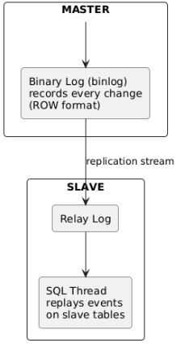

# Configuration Snippets

## Table of Contents

- [1. Phase 1 — Database Replication Setup](#1-phase-1--database-replication-setup)
  - [1.1 How MySQL Master-Slave Replication Works](#11-how-mysql-master-slave-replication-works)
  - [1.2 Master Configuration (`mysql/master/my.cnf`)](#12-master-configuration-mysqlmastermycnf)
  - [1.3 Slave Configuration (`mysql/slave/my.cnf`)](#13-slave-configuration-mysqlslavemycnf)
  - [1.4 Replication Bootstrap (`mysql/init/setup-replication.sh`)](#14-replication-bootstrap-mysqlinitsetup-replicationsh)
- [2. Phase 2 — API Development & Read/Write Splitting](#2-phase-2--api-development--readwrite-splitting)
  - [2.1 Two Connection Pools (`api/src/db.js`)](#21-two-connection-pools-apisrcdbjs)
  - [2.2 Read/Write Routing (`api/src/routes/products.js`)](#22-readwrite-routing-apisrcroutesproductsjs)
  - [2.3 Server Identity in Response](#23-server-identity-in-response)
- [3. Phase 3 — Infrastructure & Load Balancing](#3-phase-3--infrastructure--load-balancing)
  - [3.1 Nginx Round-Robin Configuration (`nginx/nginx.conf`)](#31-nginx-round-robin-configuration-nginxnginxconf)
  - [3.2 Service Dependency Chain](#32-service-dependency-chain)
- [4. Key Configuration Snippets](#4-key-configuration-snippets)
  - [4.1 Nginx Upstream](#41-nginx-upstream)
  - [4.2 MySQL Master Binary Logging](#42-mysql-master-binary-logging)
  - [4.3 MySQL Slave Read-Only](#43-mysql-slave-read-only)
  - [4.4 API Connection Pools](#44-api-connection-pools)

## 1. Phase 1 — Database Replication Setup

### 1.1 How MySQL Master-Slave Replication Works

****

1. **Master** writes every data-change event to its *binary log* (binlog).
2. **Slave's IO Thread** connects to the master and copies binlog entries into its own *relay log*.
3. **Slave's SQL Thread** reads the relay log and replays each event, keeping both databases in sync.

### 1.2 Master Configuration (`mysql/master/my.cnf`)

```ini
[mysqld]
server-id    = 1          # Unique ID — master is always 1
log_bin      = mysql-bin  # Enable binary logging
binlog_format = ROW       # Log actual row changes (most reliable)
binlog_do_db = productsdb # Only log changes to our database
sync_binlog  = 1          # Flush binlog to disk every commit (safe)
```

### 1.3 Slave Configuration (`mysql/slave/my.cnf`)

```ini
[mysqld]
server-id        = 2          # Must differ from master
relay-log        = relay-bin  # Incoming binlog events stored here
read_only        = ON         # Block accidental writes to slave
super_read_only  = ON         # Even root cannot write
replicate_do_db  = productsdb # Mirror only our database
```

### 1.4 Replication Bootstrap (`mysql/init/setup-replication.sh`)

The `replication-setup` container runs this script **once** after both MySQL nodes are healthy:

```bash
# 1. Get master's current binlog coordinates
SHOW MASTER STATUS\G
#    File: mysql-bin.000003
#    Position: 1024

# 2. Tell the slave where to start reading
CHANGE MASTER TO
  MASTER_HOST     = 'mysql-master',
  MASTER_USER     = 'replicator',
  MASTER_PASSWORD = 'replicapass',
  MASTER_LOG_FILE = 'mysql-bin.000003',
  MASTER_LOG_POS  =  1024;

START SLAVE;
```

## 2. Phase 2 — API Development & Read/Write Splitting

### 2.1 Two Connection Pools (`api/src/db.js`)

The API maintains **two separate MySQL connection pools**:

```javascript
// Write pool → points at MySQL Master
const masterPool = mysql.createPool({
  host: process.env.MASTER_HOST,  // "mysql-master"
  ...
});

// Read pool → points at MySQL Slave
const slavePool = mysql.createPool({
  host: process.env.SLAVE_HOST,   // "mysql-slave"
  ...
});
```

### 2.2 Read/Write Routing (`api/src/routes/products.js`)

```javascript
// POST /products → writes to MASTER
const [result] = await masterPool.execute(
  "INSERT INTO products (name, price) VALUES (?, ?)",
  [name, price]
);

// GET /products → reads from SLAVE
const [rows] = await slavePool.execute(
  "SELECT * FROM products ORDER BY id DESC"
);
```

### 2.3 Server Identity in Response

Every response includes `"processed_by"` identifying which API node handled the request. This proves the load balancer is distributing traffic:

```json
{
  "processed_by": "api-node-1",
  "read_from": "mysql-slave",
  ...
}
```

## 3. Phase 3 — Infrastructure & Load Balancing

### 3.1 Nginx Round-Robin Configuration (`nginx/nginx.conf`)

```nginx
upstream api_nodes {
    # Round Robin is the DEFAULT scheduling algorithm in Nginx
    server api-node-1:3000 max_fails=3 fail_timeout=10s;
    server api-node-2:3000 max_fails=3 fail_timeout=10s;
}

server {
    listen 80;

    location / {
        proxy_pass http://api_nodes;
        # If the current node fails, retry the next one automatically
        proxy_next_upstream error timeout http_502 http_503 http_504;
    }
}
```

**Round Robin behaviour:**

```
Request 1 → api-node-1
Request 2 → api-node-2
Request 3 → api-node-1
Request 4 → api-node-2
...
```

### 3.2 Service Dependency Chain

```
mysql-master (healthy)
      │
      ├─► mysql-slave (healthy, after master)
      │         │
      │         └─► replication-setup (runs once, configures binlog link)
      │
      ├─► api-node-1 (starts after both DBs healthy)
      └─► api-node-2 (starts after both DBs healthy)
                │
                └─► nginx-lb (starts after both API nodes)
```

## 4. Key Configuration Snippets

### 4.1 Nginx Upstream

```nginx
upstream api_nodes {
    server api-node-1:3000 max_fails=3 fail_timeout=10s;
    server api-node-2:3000 max_fails=3 fail_timeout=10s;
}
```

### 4.2 MySQL Master Binary Logging

```ini
server-id   = 1
log_bin     = mysql-bin
binlog_format = ROW
```

### 4.3 MySQL Slave Read-Only

```ini
server-id       = 2
read_only       = ON
super_read_only = ON
```

### 4.4 API Connection Pools

```javascript
const masterPool = mysql.createPool({ host: "mysql-master", ... }); // writes
const slavePool  = mysql.createPool({ host: "mysql-slave",  ... }); // reads
```


