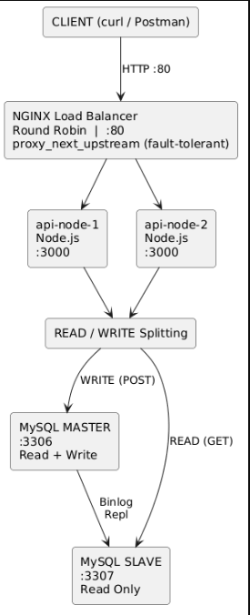

# System Architecture Diagram

## Diagram

****

**Traffic flow:**

| Operation | Path |
|-----------|------|
| `POST /products` | Client → Nginx → api-node-{1\|2} → **MySQL Master** (write) |
| `GET /products`  | Client → Nginx → api-node-{1\|2} → **MySQL Slave** (read) |

---

## Technology Stack

| Component | Technology | Version |
|-----------|------------|---------|
| Load Balancer | Nginx | alpine (latest) |
| API Runtime | Node.js + Express | 18 LTS / 4.x |
| Database | MySQL | 8.0 |
| Containerisation | Docker + Docker Compose | 24+ / 2.x |